# Pitsch

**AI-powered, human-in-the-loop pitch management and investment workflow automation.**


---

## Quick start (run the whole project)

Three services work together:

| Service | Folder | Port | Tech |
|---|---|---|---|
| Frontend | `frontend/` | 5173 | React + TypeScript + Vite |
| Backend | `backend/` | 8080 | Spring Boot 3.5, Java 21 (H2 by default, PostgreSQL optional) |
| AI service (8 agents) | `ai-service/` | 8000 | Python FastAPI + Gemini |

**Prerequisites:** Python 3.10+, Java 21 JDK, Node.js 20+.

1. **AI keys** — `ai-service/.env` holds the LLM settings (copy `ai-service/.env.example` if it's missing).
   Set `LLM_API_KEY` (Gemini key from https://aistudio.google.com/apikey) and, for real web research,
   `TAVILY_API_KEY` (free at https://tavily.com). Check them with:
   `cd ai-service && python -m scripts.check_llm` (after the first start has created `.venv`, use `.venv\Scripts\python` on Windows).
2. **Start everything:** double-click `start-dev.bat` (Windows) or run `./start-dev.sh` (macOS/Linux).
   The first run installs dependencies; the backend downloads its libraries (~1 minute).
3. Open **http://localhost:5173** and log in with **demo@pitsch.com / pitsch123**.
4. Go to **Pitches → Submit pitch email → Use sample pitch → Process email**, then follow the buttons:
   *Handle pitch* (research brief) → *Plan meeting* → pick a slot → *Draft email* → *Send* → *Mark complete*.

Manual start (three terminals): `ai-service`: `uvicorn app.main:app --port 8000` · `backend`: `mvnw spring-boot:run` ·
`frontend`: `npm install && npm run dev`. Backend health: http://localhost:8080/api/health (shows whether the AI service is reachable).

**Tests:** `cd ai-service && pytest -q` · `cd backend && mvnw test` · `cd frontend && npm run build && npm run lint`.

> Gmail, Google Calendar and Google Sheets actions run in **simulated mode**: labels, pipeline updates and sent
> emails are recorded in Pitsch and approved meetings appear in the Pitsch calendar, but nothing is sent to Google
> until OAuth integrations are added (`backend/.../workflow/ActionExecutor.java` is the one place to plug them in).

---

## Table of Contents

1. [Overview](#overview)
2. [Why Pitsch?](#why-pitsch)
3. [Implementation Status](#implementation-status)
4. [System Architecture](#system-architecture)
5. [End-to-End Workflow](#end-to-end-workflow)
6. [Frontend](#frontend)
7. [Backend](#backend)
8. [Multi-Agent AI Architecture](#multi-agent-ai-architecture)
9. [Email Processing](#email-processing)
10. [Pitch Decision Workflow](#pitch-decision-workflow)
11. [Complete Pitch Workflow](#complete-pitch-workflow)
12. [Investment Brief](#investment-brief)
13. [Human-in-the-Loop Design](#human-in-the-loop-design)
14. [Email Workflow](#email-workflow)
15. [Calendar Workflow](#calendar-workflow)
16. [Investment Pipeline](#investment-pipeline)
17. [Database](#database)
18. [Workflow States](#workflow-states)
19. [Agent Execution Status](#agent-execution-status)
20. [Notifications](#notifications)
21. [Authentication and Authorization](#authentication-and-authorization)
22. [API Reference](#api-reference)
23. [Security](#security)
24. [Audit Logging](#audit-logging)
25. [External Services](#external-services)
26. [Technology Stack](#technology-stack)
27. [Project Structure](#project-structure)
28. [Team](#team)
29. [Development Workflow](#development-workflow)
30. [Local Development](#local-development)
31. [Deployment Architecture](#deployment-architecture)
32. [Monitoring](#monitoring)
33. [Failure Handling](#failure-handling)
34. [Scalability](#scalability)
35. [Future Scope](#future-scope)

---

## Overview

Pitsch is an AI-powered pitch management and investment workflow automation platform. It is designed to automate the end-to-end handling of incoming startup pitches: reading emails, classifying them, matching follow-ups to existing pitches, analysing documents, researching companies, generating investment briefs, drafting responses, scheduling meetings, and updating an investment pipeline.

Pitsch uses a **multi-agent AI architecture** coordinated by a backend-controlled workflow, and a **Human-in-the-Loop** model in which the user reviews and approves every important external action.

### Core value proposition

| Capability | What it gives the user |
|---|---|
| Automatic email classification | Know instantly whether an email is a new pitch, a follow-up, or not a pitch |
| Follow-up matching | Follow-ups are linked to the existing pitch and its history |
| Document and research analysis | Pitch decks, company, founder, market, and competitor context in one place |
| Investment brief | Opportunities, risks, missing information, and questions to ask |
| Drafted actions | Email responses and meeting plans prepared for review |
| Human approval | Nothing important happens externally without the user's decision |

---

## Why Pitsch?

Managing startup pitches manually is time-consuming. For every incoming message, an investor or team member may need to:

- Read the email and decide whether it is a pitch or a follow-up.
- Match a follow-up with an existing pitch.
- Read pitch decks and other documents.
- Research the company, founders, market, and competitors.
- Identify opportunities, risks, and missing information.
- Prepare questions for the founders and an investment brief.
- Draft replies, schedule meetings, and update the investment pipeline.
- Track the status of each workflow and respond to pending actions.

Pitsch brings these activities into one intelligent workflow. **AI agents** perform the repetitive analysis and preparation. **Workflow automation** keeps every pitch in a tracked, well-defined state. **Human approval** ensures the user stays in control of decisions that matter, such as sending an email or scheduling a meeting.

---

## Implementation Status

This README describes the intended architecture and design of Pitsch. Items are labelled as follows:

| Label | Meaning |
|---|---|
| **Implemented** | Part of the current system |
| **In development** | Being built as part of the current effort |
| **Planned** | Future scope, not part of the current system |

| Area | Status |
|---|---|
| React + TypeScript + Vite frontend, communicating with the backend via REST | Implemented |
| Spring Boot backend with REST APIs (H2 default, PostgreSQL via `DB_URL`) | Implemented |
| Authentication (email/password, JWT) | Implemented |
| Google OAuth sign-in | Planned |
| Email ingestion (API / UI submission) and AI classification | Implemented (Gmail polling planned) |
| Workflow orchestration and the 8 AI agents (`ai-service/`) | Implemented |
| Investment brief generation (claims verified against sources, no recommendation) | Implemented |
| Human approval flows (email, meeting, workflow actions) | Implemented |
| Google Calendar / Gmail / Sheets execution | Simulated (payloads ready for real APIs) |
| Items listed under [Future Scope](#future-scope) | Planned |

> This table should be updated by the team as individual components reach completion. Deployment is not claimed.

---

## System Architecture

### Architecture principle

> **The frontend is strictly a UI layer over the backend.**

The frontend **must not** directly access any of the following:

- PostgreSQL
- AI / LLM APIs
- Gmail API
- Google Calendar API
- Google Sheets API
- AI agents
- Agent orchestration services

All of these are reached through the Spring Boot backend, which is responsible for business logic, authentication, authorization, database access, workflow management, AI orchestration, and external integrations.

```
Frontend
   ↓
Spring Boot Backend
   ↓
PostgreSQL
   ↓
Agent Orchestrator
   ↓
Specialized AI Agents
   ↓
External APIs / LLM / Research Services
```

### Architecture diagram

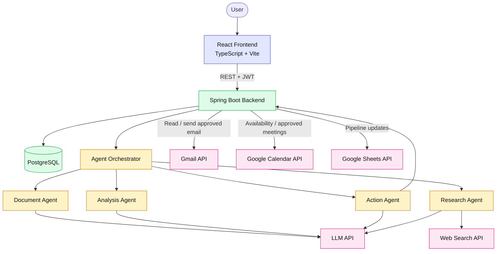

External services are accessed only through the backend and agent layers. The frontend never calls them directly.

### Layers

| # | Layer | Responsibility |
|---|---|---|
| 1 | Frontend | Display information and submit user decisions via backend REST APIs |
| 2 | Spring Boot Backend | Authentication, authorization, business logic, workflow management, database access, integrations |
| 3 | PostgreSQL | Persistent storage for users, emails, pitches, workflows, agent executions, calendar events |
| 4 | Agent Orchestrator | Coordinates workflow execution across agents |
| 5 | Specialized AI Agents | Document, Research, Analysis, and Action agents |
| 6 | External Services | Gmail, Google Calendar, Google Sheets, Web Search, LLM |

---

## End-to-End Workflow

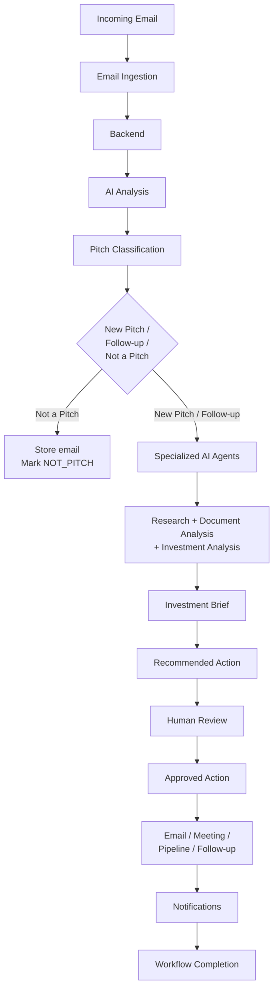

---

## Frontend

**Technology:** React, TypeScript, Vite

The frontend only **displays** information and **submits** user decisions through backend REST APIs. It does not control AI logic, run agents, or implement workflow rules.

### Responsibilities

| Area | Description |
|---|---|
| Onboarding, signup, login | User-facing authentication screens |
| Dashboard | Overview of pitches and workflows |
| Pitch list and pitch details | Browse and inspect pitches |
| Notifications | Display backend-generated notifications |
| Workflow progress | Show current workflow status and step |
| Agent execution progress | Show per-agent statuses supplied by the backend |
| Investment brief display | Render the brief returned by the backend |
| Approval/action screens | Present `availableActions` and submit the user's choice |
| Email draft review | Show recipient, subject, body; allow edit, send, cancel |
| Calendar selection | Show available slots and submit the selected slot |
| Settings | User settings |
| Loading and error states | Consistent handling of backend request states |
| Backend API integration | Communicate with the backend via REST only |

---

## Backend

**Technology:** Java, Spring Boot, Maven, PostgreSQL

The backend owns all business logic and all access to the database, AI layer, and external APIs.

### Responsibilities

- Authentication, authorization, and JWT handling
- User management
- REST APIs
- Business logic and pitch management
- Email processing
- Workflow management
- Database operations
- Agent orchestration
- External API integration
- Notifications and approval handling
- Security and audit logging

### Layered backend architecture

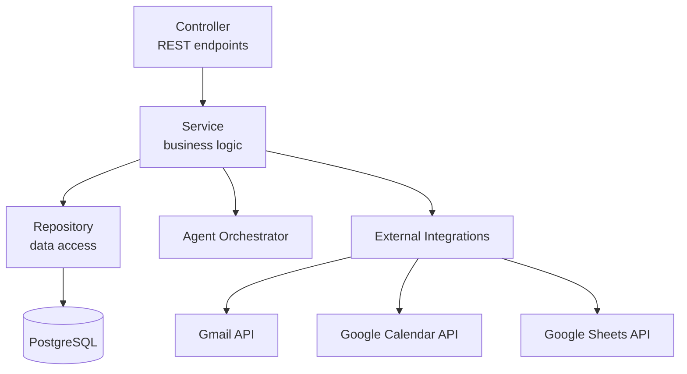

```
Controller
   ↓
Service
   ↓
Repository
   ↓
PostgreSQL
```

Services communicate with the Agent Orchestrator for AI workflows and with external integrations for Gmail, Google Calendar, and Google Sheets.

---

## Multi-Agent AI Architecture

Pitsch follows a multi-agent architecture. An **Agent Orchestrator** coordinates four specialized agents.

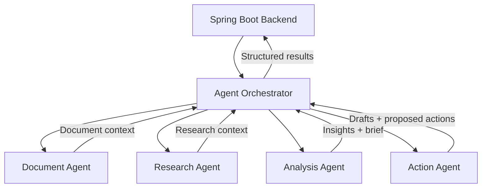

### Agent Orchestrator

- Manages workflow state
- Selects agents
- Passes context between agents
- Tracks execution
- Collects results
- Handles failures
- Coordinates workflow execution
- Returns structured results to the backend

### Specialized agents

| Agent | Responsibilities |
|---|---|
| **Document Agent** | Process PDFs and pitch decks; extract text; extract important information; generate embeddings; provide document context |
| **Research Agent** | Company, founder, market, and competitor research; funding research; recent public information; web research |
| **Analysis Agent** | Summarization; investment insights; opportunities; risks; missing information; questions to ask; combining email, document, and research context |
| **Action Agent** | Draft email responses; prepare meeting actions; update the investment pipeline; add notes and tags; trigger notifications |

---

## Email Processing

The workflow starts when a new email arrives. The possible source is the Gmail API, a configured email ingestion mechanism, or a webhook.

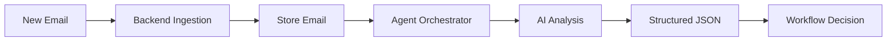

### What the AI determines

- Intent
- Whether the email is a pitch
- Whether it is a follow-up
- Previous pitch ID, if applicable
- Confidence
- Summary
- Recommended action
- Important extracted information
- Missing information

### Example structured response

```json
{
  "isPitch": true,
  "isFollowUp": false,
  "previousPitchId": null,
  "confidence": 0.96,
  "summary": "...",
  "recommendedAction": "HANDLE"
}
```

---

## Pitch Decision Workflow

After AI analysis, the backend decides how the email proceeds.

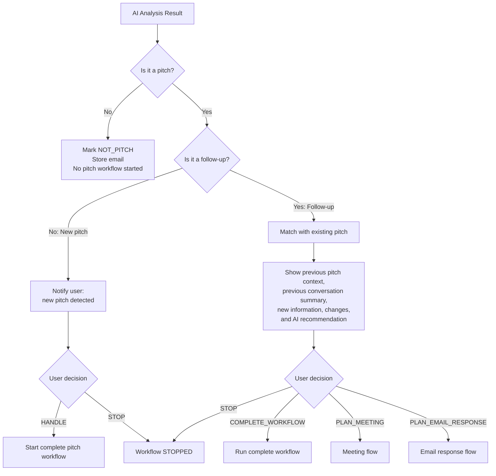

| Case | Behaviour | User actions |
|---|---|---|
| Not a pitch | Marked `NOT_PITCH`, email stored, no pitch workflow started | None |
| New pitch | User is notified and asked whether Pitsch should handle it | `HANDLE`, `STOP` |
| Follow-up | Matched with an existing pitch; previous context, conversation summary, new information, changes, and AI recommendation are shown | `COMPLETE_WORKFLOW`, `STOP`, `PLAN_MEETING`, `PLAN_EMAIL_RESPONSE` |

---

## Complete Pitch Workflow

When the user chooses to handle a new pitch:

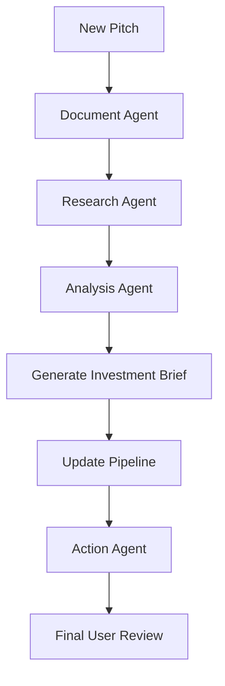

| Step | Description |
|---|---|
| 1. Document Agent | Processes the pitch deck and attached documents, extracts text and key information, and provides document context |
| 2. Research Agent | Researches the company, founders, market, competitors, and funding, using web research |
| 3. Analysis Agent | Combines email, document, and research context into insights, opportunities, risks, missing information, and questions |
| 4. Generate Investment Brief | Produces the structured investment brief |
| 5. Update Pipeline | Prepares pipeline information (company, stage, status, notes, tags) for the investment pipeline |
| 6. Action Agent | Drafts email responses and prepares meeting actions as recommended next steps |
| 7. Final User Review | The user reviews the brief and proposed actions before anything is executed externally |

---

## Investment Brief

The investment brief is generated from the available **email, document, research, and workflow context**. It can contain:

| Section | Description |
|---|---|
| Company overview | What the company is |
| Product | What it builds |
| Founders | Information about the founders |
| Market | Market context |
| Funding information | Available funding details |
| Key insights | Main takeaways |
| Opportunities | Potential positives |
| Risks | Potential concerns |
| Missing information | Details not yet provided or found |
| Questions to ask | Suggested questions for the founders |
| Research references | Sources used during research |
| Recommended next steps | Suggested actions |

The brief reflects only the context available to the system, and is intended to support, not replace, the user's judgement.

---

## Human-in-the-Loop Design

Human-in-the-Loop is one of the central concepts of Pitsch.

> **AI does not independently perform important external actions.**

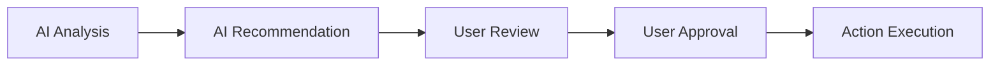

### Actions that involve the user

- Handling a new pitch
- Selecting a follow-up action
- Sending an email
- Scheduling a meeting
- Updating investment information
- Stopping a workflow

### Why this keeps the user in control

- AI produces **recommendations**, not final decisions.
- The user sees the context behind every recommendation before acting.
- External side effects (emails, meetings, pipeline updates) occur only after approval.
- The user can stop a workflow at any point where a decision is requested.
- The backend enforces this: the frontend can only submit actions the backend offers.

---

## Email Workflow

When an email response is required, the backend/AI generates a draft.

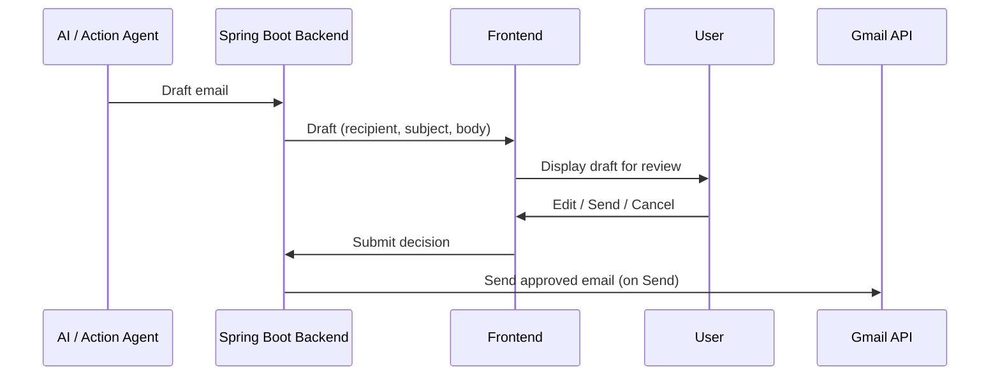

The frontend displays **recipient, subject, and body**, and the user can **edit, send, or cancel**.

> The frontend never sends the email directly. The backend performs the approved email operation through the appropriate integration.

---

## Calendar Workflow

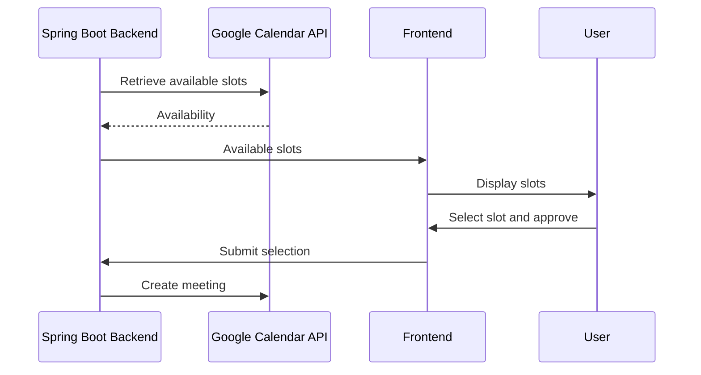

No meeting is created without appropriate user approval.

---

## Investment Pipeline

Pitsch can update investment pipeline information.

| Operation | Description |
|---|---|
| Add company | Add a company to the pipeline |
| Update stage | Change the pipeline stage |
| Update status | Change the status |
| Add notes | Attach notes |
| Add tags | Attach tags |
| Update investment information | Update related investment details |

**Google Sheets** may be used as an external pipeline integration. Pipeline updates go through the backend, and user involvement applies as described in [Human-in-the-Loop Design](#human-in-the-loop-design).

---

## Database

**Primary database:** PostgreSQL. Only the backend accesses the database.

### Entity relationship diagram

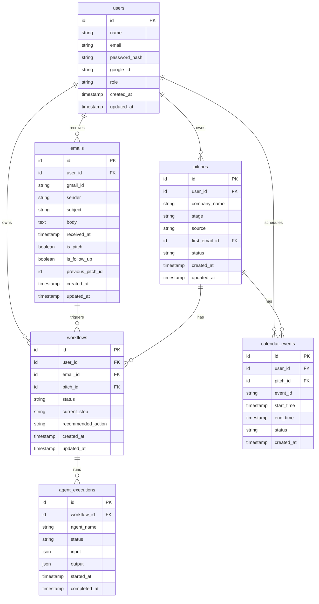

### Tables

| Table | Purpose | Columns |
|---|---|---|
| `users` | Registered users and their roles | `id`, `name`, `email`, `password_hash`, `google_id`, `role`, `created_at`, `updated_at` |
| `emails` | Ingested emails and classification results | `id`, `user_id`, `gmail_id`, `sender`, `subject`, `body`, `received_at`, `is_pitch`, `is_follow_up`, `previous_pitch_id`, `created_at`, `updated_at` |
| `pitches` | Startup pitches being tracked | `id`, `user_id`, `company_name`, `stage`, `source`, `first_email_id`, `status`, `created_at`, `updated_at` |
| `workflows` | Workflow instances, their state, and current step | `id`, `user_id`, `email_id`, `pitch_id`, `status`, `current_step`, `recommended_action`, `created_at`, `updated_at` |
| `agent_executions` | Per-agent execution tracking for a workflow | `id`, `workflow_id`, `agent_name`, `status`, `input`, `output`, `started_at`, `completed_at` |
| `calendar_events` | Meetings associated with pitches | `id`, `user_id`, `pitch_id`, `event_id`, `start_time`, `end_time`, `status`, `created_at` |

---

## Workflow States

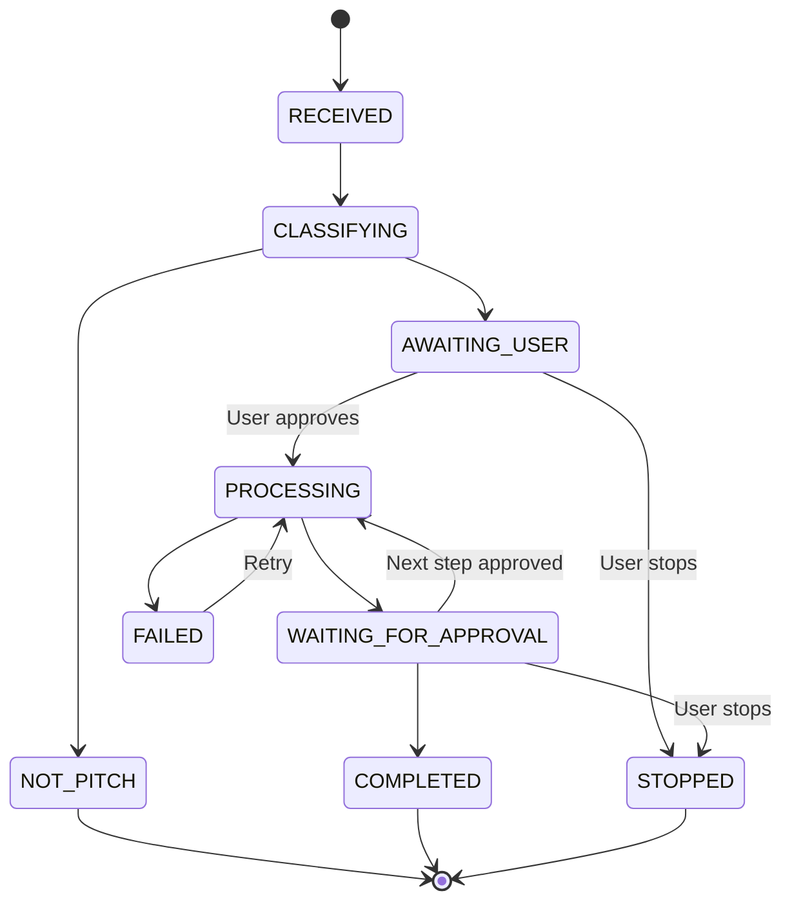

| State | Meaning |
|---|---|
| `RECEIVED` | The email has been received and stored |
| `CLASSIFYING` | AI analysis is determining intent, pitch status, and follow-up status |
| `NOT_PITCH` | The email is not a pitch; it is stored and no pitch workflow is started |
| `AWAITING_USER` | A pitch or follow-up was detected and the system is waiting for the user's decision |
| `PROCESSING` | Agents are executing the workflow |
| `WAITING_FOR_APPROVAL` | Results or proposed actions are ready and awaiting user approval |
| `COMPLETED` | The workflow finished |
| `STOPPED` | The user stopped the workflow |
| `FAILED` | An error, such as an agent failure, interrupted the workflow |

---

## Agent Execution Status

The system tracks the execution of each agent. Example:

| Agent | Status |
|---|---|
| Email Agent | `COMPLETED` |
| Document Agent | `COMPLETED` |
| Research Agent | `RUNNING` |
| Analysis Agent | `PENDING` |
| Action Agent | `PENDING` |

The frontend **displays** these statuses but does **not** implement agent execution logic. Execution and status tracking are handled by the backend and Agent Orchestrator.

---

## Notifications

| Type | Usage |
|---|---|
| `PITCH_DETECTED` | A new pitch was detected and needs a decision |
| `FOLLOW_UP_DETECTED` | A follow-up to an existing pitch was detected |
| `WORKFLOW_COMPLETED` | A workflow finished |
| `ACTION_REQUIRED` | The user needs to review or approve something |
| `AGENT_FAILED` | An agent failed during a workflow |
| `MEETING_READY` | Meeting options or a meeting action is ready |
| `EMAIL_READY` | An email draft is ready for review |

### Channels

- In-app notifications
- Email notifications
- Meeting invitations
- Workflow status updates
- Action reminders

---

## Authentication and Authorization

### Authentication

| Endpoint | Description |
|---|---|
| `POST /api/auth/signup` | Create an account |
| `POST /api/auth/signin` | Sign in and receive a token |

Supported methods: **email/password**, **Google OAuth**, and **JWT**.

Authenticated requests use:

```http
Authorization: Bearer <JWT_TOKEN>
```

### Authorization

Role-based access control may include the following roles:

| Role |
|---|
| Admin |
| Investor |
| Team Member |

Authorization is **enforced by the backend**. The frontend may adapt its UI to a user's role, but it is never the source of access control.

---

## API Reference

All endpoints are served by the Spring Boot backend.

### Authentication

| Method | Endpoint | Description |
|---|---|---|
| POST | `/api/auth/signup` | Register a new user |
| POST | `/api/auth/login` (alias `/signin`) | Authenticate and return a JWT |

### Emails

| Method | Endpoint | Description |
|---|---|---|
| POST | `/api/emails/process` | Submit an email for processing through the workflow |
| GET | `/api/emails` | List emails |
| GET | `/api/emails/{id}` | Get a single email |

### Pitches

| Method | Endpoint | Description |
|---|---|---|
| GET | `/api/pitches` | List pitches |
| GET | `/api/pitches/{id}` | Get pitch details |

### Workflows

| Method | Endpoint | Description |
|---|---|---|
| GET | `/api/workflows` | List workflows |
| GET | `/api/workflows/{id}` | Get workflow details, status, and available actions |
| POST | `/api/workflows/{id}/action` | Submit the user's chosen action for a workflow |

### Notifications

| Method | Endpoint | Description |
|---|---|---|
| GET | `/api/notifications` | List notifications |
| PATCH | `/api/notifications/{id}/read` | Mark a notification as read |

### Calendar

| Method | Endpoint | Description |
|---|---|---|
| GET | `/api/calendar/availability` | Retrieve available meeting slots |
| POST | `/api/calendar/meeting` | Create a meeting after user approval |

### Workflow API example

```json
{
  "workflowId": 102,
  "status": "AWAITING_USER",
  "type": "FOLLOW_UP",
  "recommendedAction": "PLAN_EMAIL_RESPONSE",
  "availableActions": [
    "COMPLETE_WORKFLOW",
    "STOP",
    "PLAN_MEETING",
    "PLAN_EMAIL_RESPONSE"
  ]
}
```

The frontend **renders `availableActions` as provided by the backend** and does not invent workflow logic. If the backend changes which actions are available, the UI follows.

---

## Security

| Area | Description |
|---|---|
| JWT authentication | Authenticated API access via bearer tokens |
| OAuth | Google OAuth sign-in support |
| Role-based access control | Admin, Investor, and Team Member roles enforced by the backend |
| HTTPS | Encrypted transport |
| Input validation | Backend validation of all incoming data |
| CORS | Restricted to approved frontend origins |
| Rate limiting | Protection against excessive requests |
| Secure token handling | Careful handling and storage of tokens |
| Encrypted credentials | Stored credentials are encrypted |
| Backend-only API secrets | All API secrets remain on the backend |
| Audit logs | Important operations are tracked |

> **The frontend never stores or exposes sensitive backend credentials.**

Sensitive credentials, all held on the backend only:

- Database credentials
- LLM API keys
- Gmail credentials
- Google Calendar credentials
- Google Sheets credentials
- OAuth secrets
- JWT secrets

Secrets must be supplied through environment configuration and must never be committed to the repository.

---

## Audit Logging

Important operations can be tracked for accountability and debugging:

- User login
- Workflow creation
- Workflow state changes
- User approval
- User stop action
- Agent execution
- Email sending
- Meeting creation
- Pipeline updates

---

## External Services

All external services are accessed through the backend and agent layers.

| Service | Purpose |
|---|---|
| **Gmail API** | Read emails; send approved email responses |
| **Google Calendar API** | Read availability; find meeting slots; create approved meetings |
| **Google Sheets API** | Update the investment pipeline: company information, notes, tags, status |
| **Web Search API** | Company, founder, market, and competitor research; recent information |
| **LLM API** | Classification, summarization, extraction, analysis, question generation, email generation, structured outputs |

---

## Technology Stack

| Category | Technologies |
|---|---|
| Frontend | React, TypeScript, Vite |
| Backend | Java, Spring Boot, Maven |
| Database | PostgreSQL |
| AI | LLM APIs, Multi-Agent Architecture |
| Authentication | JWT, OAuth |
| External integrations | Gmail API, Google Calendar API, Google Sheets API, Web Search API |
| Development | Git, GitHub, Visual Studio Code |
| Deployment | Docker, cloud platforms |

---

## Project Structure

```
pitsch/
│
├── backend/
│   ├── src/
│   │   ├── main/
│   │   │   ├── java/
│   │   │   └── resources/
│   │   └── test/
│   ├── pom.xml
│   └── mvnw
│
├── frontend/
│   ├── public/
│   ├── src/
│   │   ├── components/
│   │   ├── hooks/
│   │   ├── pages/
│   │   ├── services/
│   │   ├── types/
│   │   ├── utils/
│   │   ├── App.tsx
│   │   └── main.tsx
│   ├── package.json
│   └── vite.config.ts
│
├── README.md
└── .gitignore
```

---

## Team

| Member | Area | Responsibilities |
|---|---|---|
| Yash Kamble | Frontend | React UI, dashboard, authentication UI, pitch interfaces, workflow UI, notifications, agent progress, investment brief UI, email approval UI, calendar UI, backend API integration |
| Ayush Kumawat | Backend | Spring Boot, REST APIs, authentication, authorization, PostgreSQL, business logic, workflow management, external integrations, agent orchestration integration, security |
| Arav | AI | AI architecture, LLM integration, Agent Orchestrator, Document/Research/Analysis/Action agents, pitch classification, follow-up detection, investment analysis, investment brief generation, AI recommendations |

---

## Development Workflow

The three areas, **Frontend**, **Backend**, and **AI**, are developed independently and integrated through the main repository.

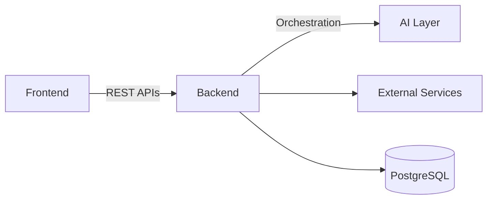

- The frontend communicates with the backend through REST APIs.
- The backend communicates with the AI layer and external services.
- The backend owns database access.

---

## Local Development

### Prerequisites

- Git
- Node.js
- npm
- Java 21
- Maven
- PostgreSQL

### Clone

```bash
git clone https://github.com/void024/pitsch.git
cd pitsch
```

### Backend

```bash
cd backend
./mvnw spring-boot:run
```

Backend URL: `http://localhost:8080`

### Frontend

```bash
cd frontend
npm install
npm run dev
```

Frontend URL: `http://localhost:5173`

### Local architecture

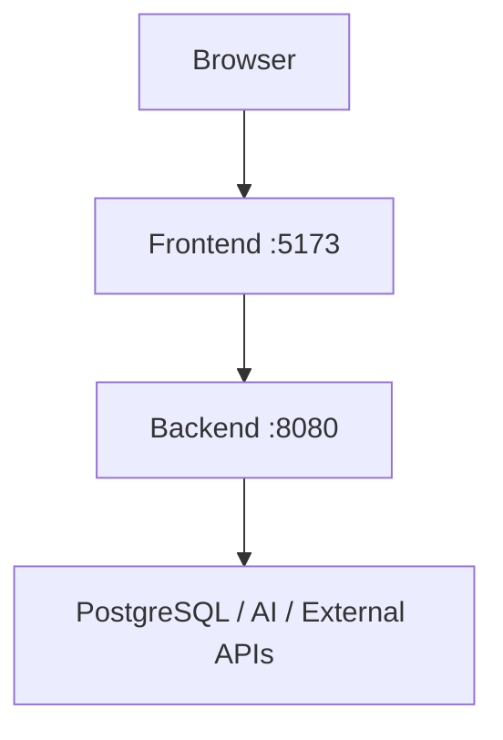

---

## Deployment Architecture

The following describes a possible production architecture. **No deployment is claimed at this time.**

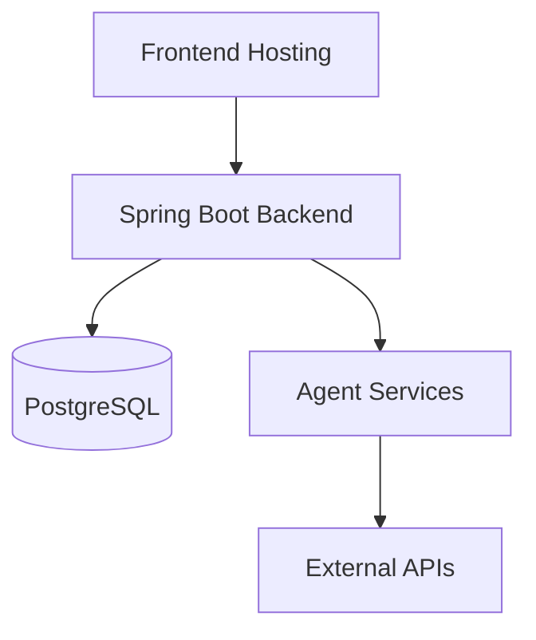

Possible deployment technologies:

- Docker
- Render
- AWS
- Google Cloud

---

## Monitoring

| Area | Description |
|---|---|
| Application logs | General backend logging |
| API logs | Request and response activity |
| Workflow logs | Workflow state transitions |
| Agent execution logs | Per-agent execution records |
| Authentication logs | Sign-in and authentication events |
| Error monitoring | Detection and tracking of errors |
| Health checks | Service availability checks |
| Performance monitoring | Latency and throughput visibility |

---

## Failure Handling

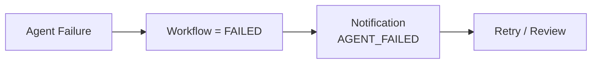

When an agent fails, the workflow moves to `FAILED`, the user is notified, and the user can review and retry. The system provides visibility into failed workflows and agent executions through workflow status and `agent_executions` records.

---

## Scalability

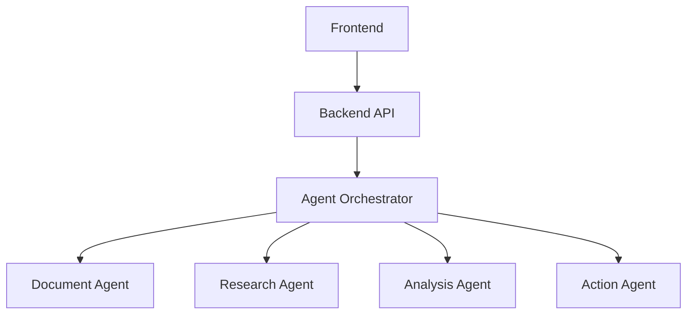

The layered design allows each tier to grow separately. Because specialized agents are independent, they can be scaled or processed independently as workload increases.

---

## Future Scope

> The following are **planned** capabilities, not current features.

- Advanced semantic pitch matching
- Retrieval-Augmented Generation (RAG)
- Better document understanding
- Advanced company research
- Founder research
- Market analysis
- Follow-up prioritization
- Conversation memory
- More specialized AI agents
- Agent analytics
- Workflow analytics
- Multi-user collaboration
- Advanced role management
- Mobile application
- Production observability
- More integrations

---

**Project:**
Pitsch

**GitHub:**
https://github.com/void024/pitsch

**Team:**

- Frontend — Yash Kamble
- Backend — Ayush Kumawat
- AI — Arav

*Pitsch is an AI-powered, human-in-the-loop pitch and investment workflow platform: AI agents prepare the analysis and recommendations, and the user stays in control of every important decision.*
